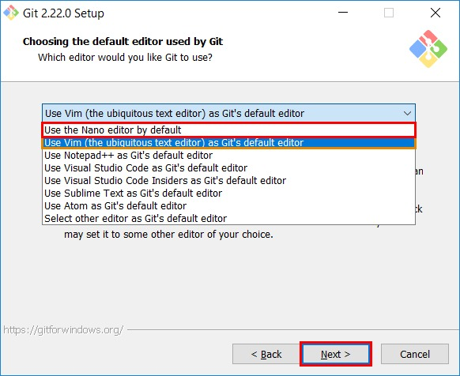

### Download

Git can be easily downloaded and installed, OS specific instructions can be found on the official website:

[https://git-scm.com/](https://git-scm.com/)

### Instructions during installation

**(For Windows Users)**

Select the commit message editor to be notepad instead of the default one (vim), as it can difficult to use for beginners.


### Post installation setup

Let's tell git about ourselves, it's just like setting up a local account on git so that it knows us:

```bash
git config --global user.name "John Doe"
git config --global user.email "john.doe@website.com"
```

Replace the name with your GitHub username, and the email with your email that you made the account with on GitHub.

> There is one thing to learn here that is this `--global` flag. Only use this flag with the command if you want to setup this configuration globally through out your machine. If you want to specifically setup some folder with a different account you can skip this flag.
